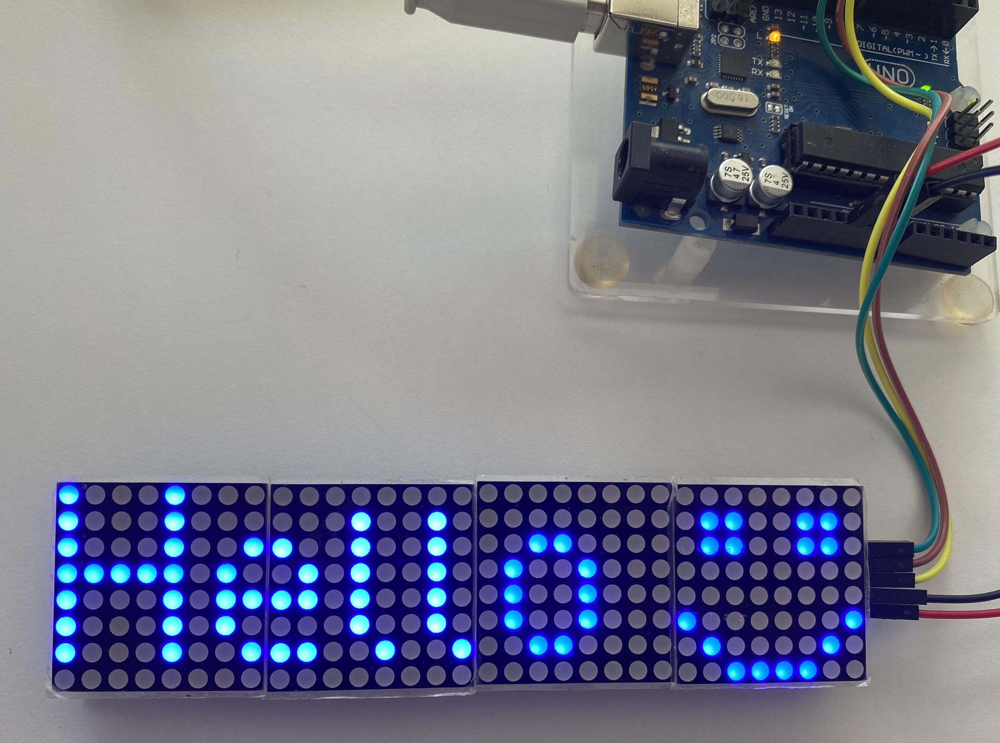
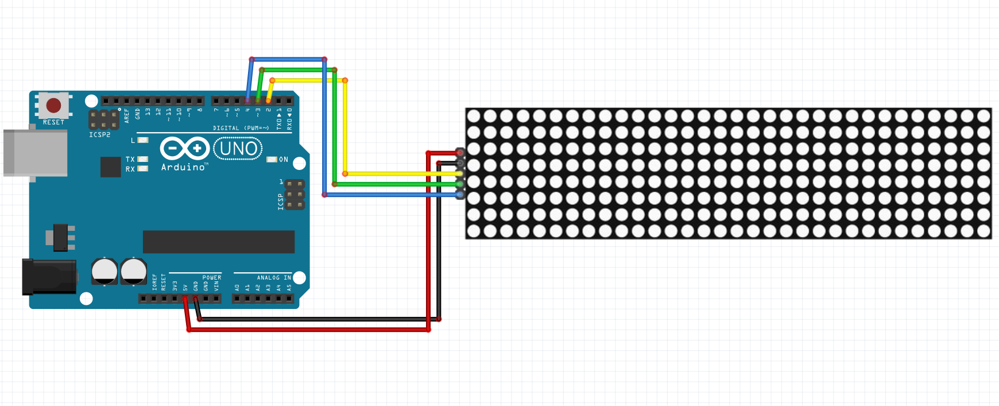

# Arduino led matric displayer (8x32) smartphone controller
An arduino displayer controlled by a mobile application with bluetooth
```
              _        _   __    __  ___ 
  /\/\   __ _| |_ _ __(_) / /   /__\/   \
 /    \ / _` | __| '__| |/ /   /_\ / /\ /
/ /\/\ \ (_| | |_| |  | / /___//__/ /_// 
\/    \/\__,_|\__|_|  |_\____/\__/___,'  
```

---
## Arduino setup
### Preview


### Circuit

The led matric I used: [Matrice Led MAX7219](https://fr.aliexpress.com/item/32620800331.html?channel=twinner).   

---
# Commit layout
{Type} [Action] Description
  - Type : "SETUP" "FILE" "FOLDER" "MERGE" ... : describe the type of changement you're commiting
  - Action : Create / Add / Import / Modif / Move / Remove / Delete
  - Description : description of the `Action` made
